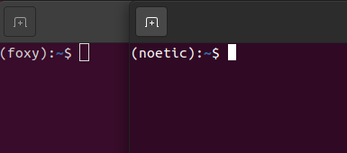
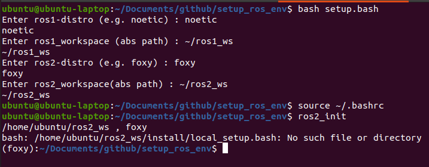

# Setup ROS env

Display the ROS environment on the terminal like pyenv.



## Setup (Ubuntu 20.04 LTS + ROS-Foxy + ROS-Noetic)

```bash
$ cd ~
$ git clone https://github.com/Ar-Ray-code/setup_ros_env.git
$ cd setup_ros_env
$ git checkout ubuntu20
$ sh autowrite_bashrc.sh
>> Enter ros1_workspace(abs path) : ~/ros1_ws
>> ~/ros1_ws
>> Enter ros2_workspace(abs path) : ~/ros2_ws
>> ~/ros2_ws
```



 In "Enter ros__x___workspace (abs path):", enter the ROS workspace that contains the absolute path. If you Enter empty, the setting will be skipped.

## ROS Environment setup

### ROS1

```bash
example@example:~$ ros1_init
(noetic):~$
```

### ROS2

```bash
example@example:~$ ros2_init
(foxy):~$
```

## About writer

- Ar-Ray : Japanese student. 
- Blog(Japanese) : https://ar-ray.hatenablog.com/
- Twitter : https://twitter.com/Ray255Ar